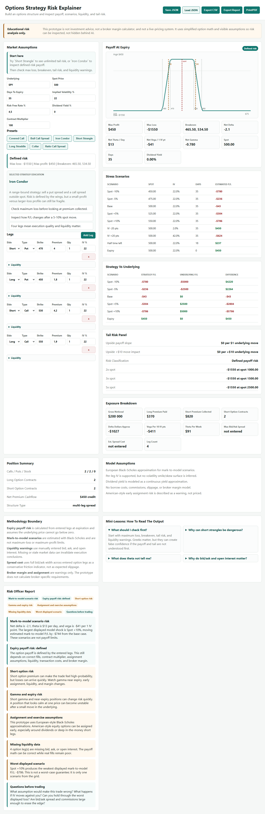

# Options Strategy Risk Explainer

[](https://github.com/rafalwronapl/options-strategy-risk-explainer/actions/workflows/ci.yml)
[](https://github.com/rafalwronapl/options-strategy-risk-explainer/actions/workflows/codeql.yml)
[](LICENSE)
[](package.json)

Prototype of an educational options strategy risk explainer.

Live demo: https://rafalwronapl.github.io/options-strategy-risk-explainer/

The product angle is deliberately not "AI tells you what to trade". The core idea is:

> Deterministic math engine first. AI, if added later, only explains calculated risk.

This static prototype runs locally in a browser and lets a user build a multi-leg option strategy, inspect payoff, Greeks, stress scenarios, liquidity warnings, tail risk, strategy education notes, and a plain-language risk report.

## Why This Matters

Options tools often blur the line between calculation, education, and trading
advice. This prototype keeps that boundary explicit: deterministic calculations
produce payoff, Greeks, stress rows, and risk labels; explanatory text only
describes those calculated outputs.

That makes the project useful as a browser-only risk explainer and as a clean
foundation for any future AI layer that must stay source-backed.

## Run In 60 Seconds

Open the live demo, or run locally:

```bash
npm ci
npm run check
```

For local use without installing dependencies, open `index.html` directly in a
browser.

## Demo

Open `index.html` locally, then load one of the sample strategies from
`examples/`.



## Run

Open `index.html` in a browser.

No install, no API keys, no backend.

Use `Load JSON` with files from `examples/` to test known structures:

- `iron-condor-defined-risk.json`
- `short-strangle-unlimited-risk.json`
- `covered-call-dividend-risk.json`
- `protective-put-defined-risk.json`

## Development

```bash
npm run check
```

The project is intentionally dependency-light. The prototype is plain HTML/CSS/JS and the tests run with Node.
The browser smoke test uses Playwright to verify core UI interactions.

## Current Scope

- European Black-Scholes approximation for calls and puts.
- Manual option legs: long/short, call/put, strike, premium, quantity, per-leg IV, bid, ask, open interest.
- Presets: covered call, bull call spread, iron condor, short strangle, long straddle, collar, ratio call spread.
- Payoff chart at expiry.
- Breakeven markers, strike markers, and current spot marker.
- Net Greeks estimate.
- Stress scenarios across price, IV, and time.
- Deterministic risk officer report.
- Quick risk summary near the strategy builder.
- Selected-strategy education notes and mini-lessons.
- Save/load strategy JSON.
- Basic schema validation and size limit for loaded strategy JSON.
- Text risk report export.
- Browser Print/PDF report mode.
- Strategy vs underlying comparison.
- Exposure breakdown.
- IV stress shifts each option leg relative to its own IV.
- Liquidity warnings for wide bid/ask spreads and low open interest.
- CSV export for assumptions, legs, and scenario rows.
- Core math tests.
- Browser smoke test for preset selection, JSON import, chart rendering, and stock cost-basis labeling.

## Important

Read [DISCLAIMER.md](DISCLAIMER.md) before using the prototype for any real-world analysis. The tool is educational and does not provide investment advice or trading recommendations.

Validation details are documented in [VALIDATION.md](VALIDATION.md).

See [CHANGELOG.md](CHANGELOG.md) for the current prototype feature set.

Security notes are in [SECURITY.md](SECURITY.md).

The code is released under the [MIT License](LICENSE).

## Not In Scope Yet

- Trading signals.
- Buy/sell recommendations.
- Broker execution.
- Live market data.
- Tax, suitability, or personalized investment advice.
- Broker margin calculation.
- American exercise pricing.
- Borrow costs, skew, slippage, or commissions.

## Safety Design

The prototype separates calculation from explanation:

- deterministic code calculates payoff, Greeks, stress scenarios, liquidity warnings, and exact payoff tail classification;
- the report explains only calculated outputs;
- no LLM is used in the current version;
- future AI features should consume a JSON calculation bundle and must not invent market data or recommendations.

## Verification

Run:

```bash
npm run check
```

This checks JavaScript syntax and runs core math tests for:

- normal CDF,
- Black-Scholes call/put prices and dividend-yield effect,
- comma decimal parsing,
- bull call spread payoff,
- short call unlimited upside loss,
- iron condor defined risk/reward,
- covered call defined risk/reward,
- short strangle unlimited upside loss.
- browser smoke coverage for preset selection, selected-strategy education, JSON import, and nonblank chart rendering.

## Next Technical Steps

1. Add PDF export.
2. Add portfolio-level exposure by underlying and expiration.
3. Add better mobile chart controls.
4. Add margin/risk approximations per broker model.
5. Add optional data adapter for ORATS, Polygon, Tradier, IBKR, or Deribit.
6. Add LLM explanation layer only after all numbers are source-backed.
